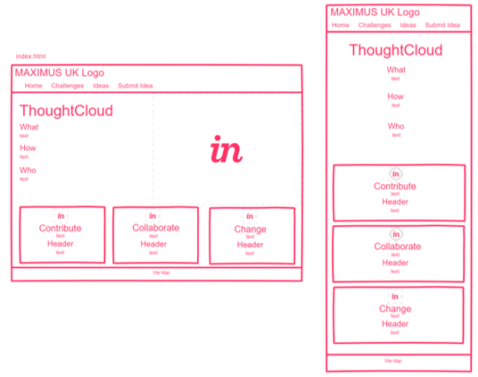
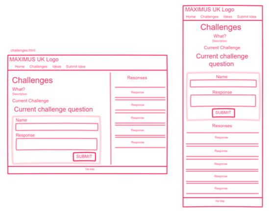
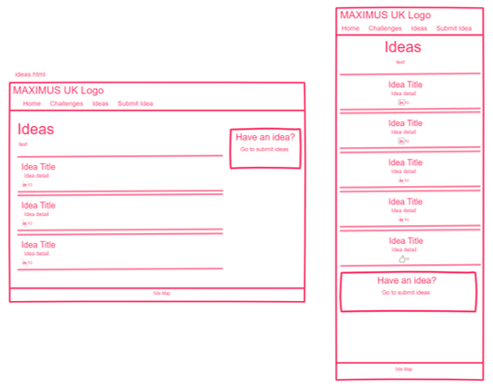
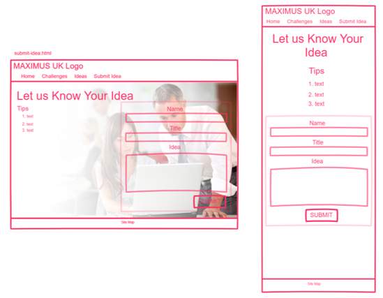
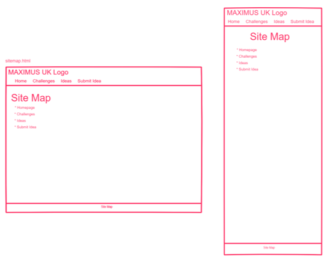
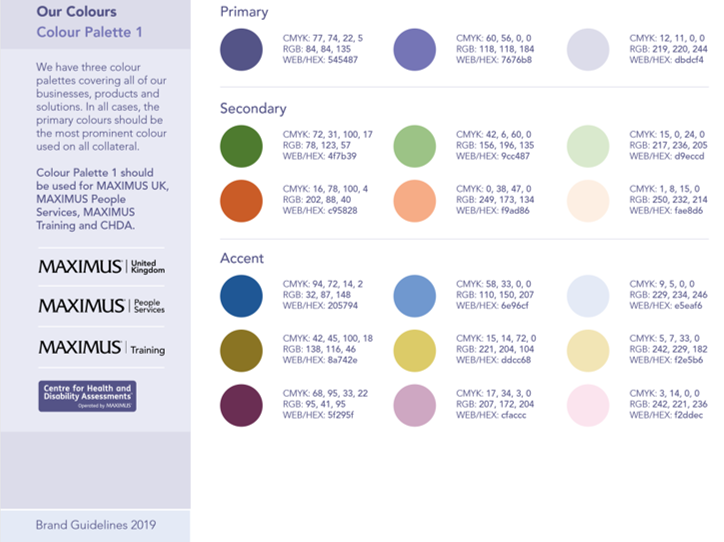

# Edward Gilmore
# CDA404 Work-Based Project

## Background

MAXIMUS Human Services are seeking ways to better engage staff with the business and also to explore better ways of working, but currently lack ways in which to do this. Staff are spread across the UK, with limited opportunities to come together. As a result, there is limited scope for staff to collaborate and share ideas outside of their immediate teams, and similarly it is difficult for central teams to ask opinions of the business.

In order to address this, a digital platform allowing all staff to share ideas is a preferable solution. This solution would need to be hosted internally, requiring Active Directory credentials before login.

## Wire Frames

> **index.html**
>
> 

> **challenges.html**
>
> 

> **ideas.html**
>
> 

> **submit-idea.html**
>
> 

> **site-map.html**
>
> 

## Colour Choices

MAXIMUS have approved branding guidelines which detail colour schemes to be used on all print and digital materials which have been adhered to throughout. Primary colours have been used to denote prominent areas including navigation, footers and data input areas, with secondary accent colours used to illustrate related items with different content on the homepage, and also to indicate related themes across the website in using the orange accents on the ideas and challenge pages to denote staff responses.

> **MAXIMUS UK Brand Guidelines 2019**
>
> 

## Accessibility

Once the site was developed, all content was reviewed against the W3C Accessibility Standards using [Easy Checks - A First Review of Web Accessibility](https://www.w3.org/WAI/test-evaluate/preliminary/). 

There is no moving, flashing or multimedia content on the site, so no steps have been taken to address these areas of accessibility.

### Page Titles

All page titles state the name of the site and the page topic to ensure that they are accessible.

### Images

All images and icons have been given a descriptive alternative text to assist screen readers.

### Headings

Each page has a h1 heading at the top of the main portion of the page. Subsequent headings have been implemented in a hierarchical fashion to denote the importance of a topic.

### Contrast Ratio

Text contrasts have been checked using [WebAIM's Contrast Checker](https://webaim.org/resources/contrastchecker/) to ensure sufficient readability.

### Text Resizing

All text resizes on zoom and elements do not overlap.

### Keyboard Access and Visual Focus

All selectable elements tab in top-to-bottom, left-to-right order when using the keyboard and links can be accessed using the enter key on the keyboard. 

### Forms, Labels and Errors

All text entry fields on forms are set to required with and asterisk after the label to denote this. When inputs are incomplete on submission, a red border is added to the field and an alert is displayed listing the missing fields.

## GDPR

As the website is for internal use only and will be accessed securely via the company intranet, all users will already be bound by a number of policies which encompass GDPR as well as information security, computer misuse and data privacy; all of which are all available on the intranet where this site would reside. As such, it has not been deemed necessary to reference these from within the site.

Were this deployed as a standalone site used externally, a link would be included at the bottom of the page alongside the site map to the [MAXIMUS UK Privacy Policy](https://maximusuk.co.uk/privacy-policy) for reference rather than a local version held on the site itself to ensure the most up-to-date version of the policy is always being referenced. Opt-outs would also be provided on all forms to comply with GDPR.

## Distance Selling

No goods or services are being sold, so The Consumer Contracts (Information, Cancellation and Additional Charges) Regulations 2013 are not applicable to the website.

## Evaluation

The final implementation of the site comprehensively meets the requirements to create a platform which both allows for proactive contribution from staff and functionality for central services to set out challenges for response. 

The only area of desired functionality which has not been implemented is the retrieval and posting of data from and to a server via API as it would require access to MAXIMUS' secure servers and significant server-side work to create the APIs, both of which are beyond the scope of this assignment. Where this behaviour would be implemented to retrieve data in ideas.html and challenges.html, the latter part of the function to load in an array of data has been implemented, however, arrays have been hard-coded in place of an GET request to mimic functionality. Where data would be posted in challenges.html and submit-idea.html, the arrays have been created and logged to console to demonstrate successful capture of the data which would then be pushed via API to the server. Similarly, the 'likes' in ideas.html would also require an outbound push to the server with the updated number.

The first stage of laying out the site was to separate out the desired functionality into logical groupings which would define the number of pages required and their contents. This defined the four pages delivered (excluding the site navigation), each with an individual purpose: a principal navigation, viewing and responding to challenges, submitting ideas, and viewing and 'liking' colleagues' ideas. 

With the broad overview in mind, hand-drawn wireframes were drawn up for desktop devices. The majority of users in MAXIMUS use either desktops or laptops for the majority of their work, so a desktop-first approach was taken. The general concepts of design were relatively simple; to keep block text to a minimum, use colour and block objects to identify correlated themes and ideas as detailed in the colour choices, and to use space as an indication of primary and secondary areas of pages. As an example, index.html has three elements at the bottom of the page of equal size to denote shared importance, with similar formatting to indicate that they are thematically linked, but different colour schemes to indicate that the content is differing. Another example of the use of space can be seen in challenges.html with a 70:30 vertical split drawing the user to the larger, more important content on the left of the screen first.

Development began using these wire frames, but the static nature of these allowed little flexibility, so digitised versions were drawn up a short time after beginning development using Invision when conceived ideas were not practicable. Whilst the overall design was not greatly departed from, the use of digital wire frames allowed for easy re-positioning and re-sizing of elements.

All images and icons used on the site have already been licensed to MAXIMUS and thus do not require acknowledgements, with the exception of the 'like' icons which were drawn from scratch and so again do not require acknowledgement. Icons were converted to .svg format for better scaling.

The development was predominately completed on a large high-resolution desktop. Because of this, testing was also done on a smaller laptop which presented some issues which required correcting. For example, the use of a background image on sumbit-idea.html necessitated the use of absolute positioning for the instructions and form which were initially placed in a vertical format and, on a smaller screen or zooming in, made the div float over the footer. In order to overcome this, the tips and form were laid out side-by-side and an additional break point was introduced at below 1200px for the page. In future, it may be better to move away from absolute positioning if it is only used aesthetically as was the case in this development.

Responsive design was initially scoped with a 600px width break point, however, this caused some issues with sizing and spacing of elements on larger mobile devices up to 768px, so the break point was moved to this. A further break point was introduced specifically for submit-ideas.html to overcome the absolute positioning issue also. In scaling down to mobile, larger images were removed, and elements have been stacked vertically with the left-to-right flow of elements stacked top-to-bottom to ensure that primary content remains at the top. Text has, with the exception of lists, been centred for ease of reading. Responsive design was very much a trial-and-error process using developer tools to emulate the views on differing devices and tweaking the code accordingly.

JavaScript has been implemented throughout the site to handle several different functions including the iteration of loading elements from arrays, writing responses back to an array, event listeners, form validation and warnings, and updating elements. This was a particularly challenging part of the development which required a good deal of test-and-learn, with significant reference to [W3Schools JavaScript pages](https://www.w3schools.com/js/default.asp) for assistance.

Finally, the site was reviewed for accessibility compliance as detailed earlier in the Accessibility section. This review necessitated some small changes to colour contrast on forms, buttons and cards text, and was a useful process to understand. In the future, it would be sensible to complete the colour checks before development as it was a fairly laborious process to rectify at the end of development.

In conclusion, the final site comprehensively delivers the required functionality to a high-quality level and complies to relevant regulatory standards.